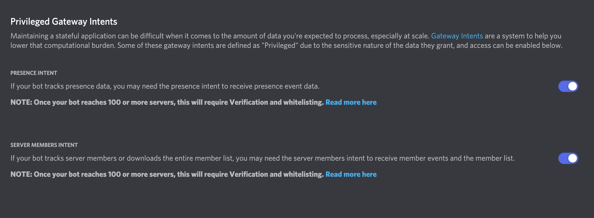
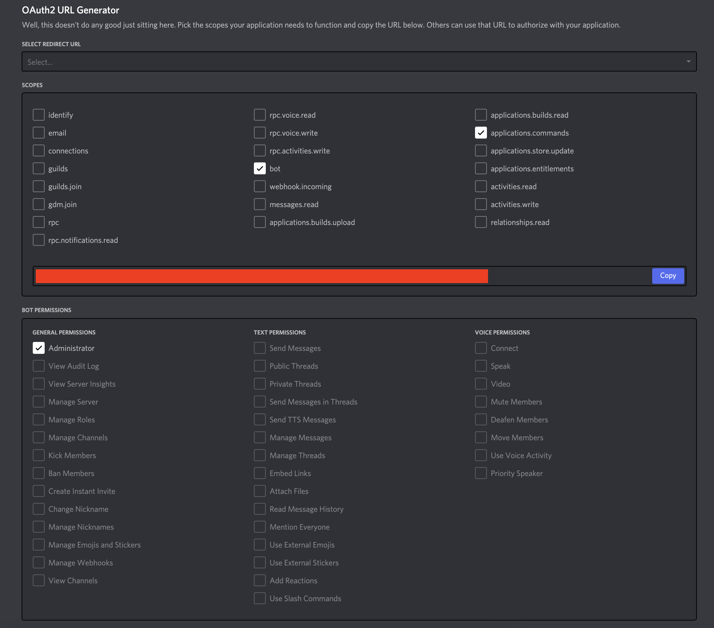

# DiscordJS-Template
DiscordJS Bot Template
```console
$ npm install
```
Type `npm install` to install Library.

## How To Install
Type
```console
$ git clone https://github.com/roy2554/DiscordJS-Template
```

## How To Run
Type
```console
$ node index.js
```
or
```console
$ node .
```
in console

## Errors
### DISALLOWED_INTENTS
  
⚠️You Must Turn on PRESENCE INTENT and SERVER MEMBERS INTENT.
### I CANT USE SLASH COMMAND IN SERVER
  
⚠️Setting the Bot Permissions
## License
DiscordJS-Template Using MIT License.  
&copy;roy2554
